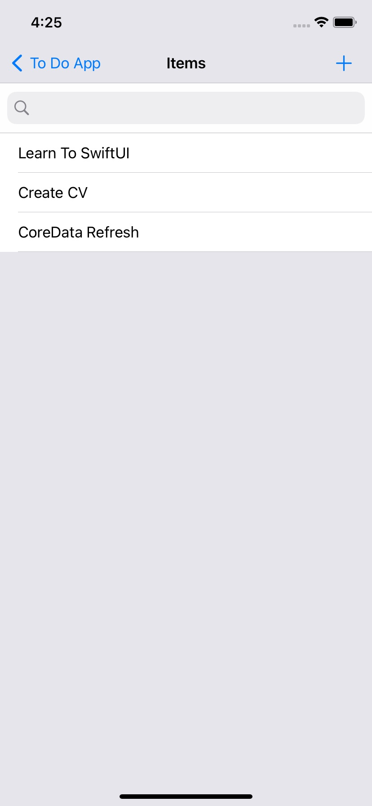

# Todo App

A todolist app to keep track of all your tasks uses CoreData.

**Exapmle:**

**Cron Expression Parser**

Hello! This is Cron Expression Parser.

To run the program follow this instruction:
1. Open your terminal
2. Go to 'cron' directory
3. Write 'ruby cron.rb'
4. Write your cron string. Consider the standard cron format with five time fields (minute, hour, day of month, month, and day of week). Example: '*/15 0 1,15 * 1-5 /usr/bin/find'
